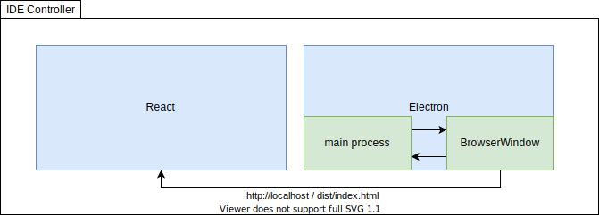

# IDE-Controller

## prerequisites

### Install Node.js and Yarn on Mac

https://nodejs.org/en/download/

https://yarnpkg.com/getting-started/install

### Install Chocolatey and Node.js on Windows

Install Chocolatey
https://chocolatey.org/

Open Command Prompt - Run as Administrator
choco install nodejs

## Getting started

In the project directory, you can run:

### `npm install`

Uses the Node Package manager to install the project dependencies.

### `npm run dev`

Runs the app in the development mode. 

Electron app will reload if you make edits. 
You will also see any lint errors in the console.

### `npm run test`

Launches the test runner in the interactive watch mode. 
See the section about [running tests](https://facebook.github.io/create-react-app/docs/running-tests) for more information.

### `npm run build`

Builds electron app for production to the `packages/electron/dist` folder. 
It correctly bundles React in production mode and optimizes the build for the best performance.

The build is minified and the filenames include the hashes. 
Your app is ready to be deployed.

## Code Structure

This project uses lerna which is a tool for managing JavaScript projects with multiple packages. [Read more about Lerna](https://github.com/lerna/lerna)

The packages directory includes 2 packages. The first one is react where react components are. The second package is electron this is where the native desktop application is built.

